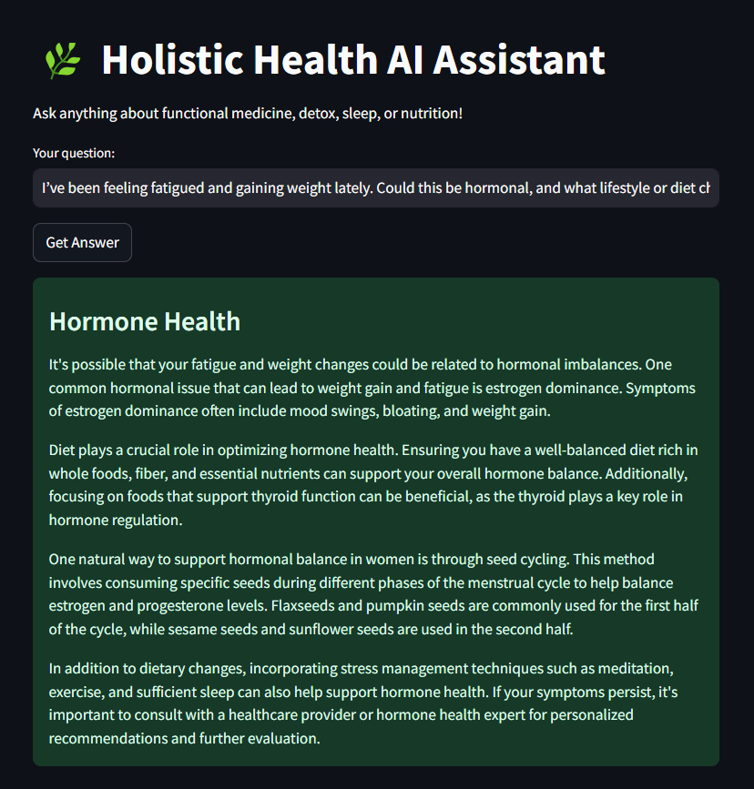

# 🌿 Holistic Health AI Assistant

An autonomous **multi-agent AI system** that provides evidence-based answers to questions about **functional medicine**, **biohacking**, **detox**, and more. Powered by GPT-3.5, semantic search with FAISS, and PubMed integration.

---

## Overview

This project was developed for the **Agentic AI Innovation Challenge 2025**, hosted by Ready Tensor.  
It demonstrates a structured LLM workflow combining:

- Multi-agent architecture
- FAISS vector search
- Domain-specialised embeddings
- Retrieval-augmented generation (RAG)
- GPT-3.5 for reasoning and synthesis

---

## Architecture

The assistant uses a multi-agent design:
- **User Query**
- **GPT-3.5** for query categorisation
- **Agent per Category** retrieves documents via FAISS + MiniLM embeddings
- **Agent-level GPT responses**
- **Synthesis** into a final coherent answer

---

## Categories (Agents)
- Nutrition
- Herbal Remedies
- Sleep & Circadian Rhythm
- Mental Health
- Detox
- Hormone Health

Each agent maintains its own FAISS index over curated and PubMed-enriched documents.

---

## Data Sources
- Hardcoded wellness knowledge
- Real-time abstracts from **PubMed API** using user query keywords

---

## Example Demo Screenshot

---

## Technologies
- Python + Streamlit
- OpenAI GPT-3.5
- FAISS
- Sentence Transformers (MiniLM-L6-v2)
- PubMed API (Entrez)

---

## Live Demo
👉 [Try the App](https://holistic-health-assistant.streamlit.app/)

---

© 2025 Ayşenur Dalfidan  
This project was developed for the Agentic AI Innovation Challenge 2025. All rights reserved.
